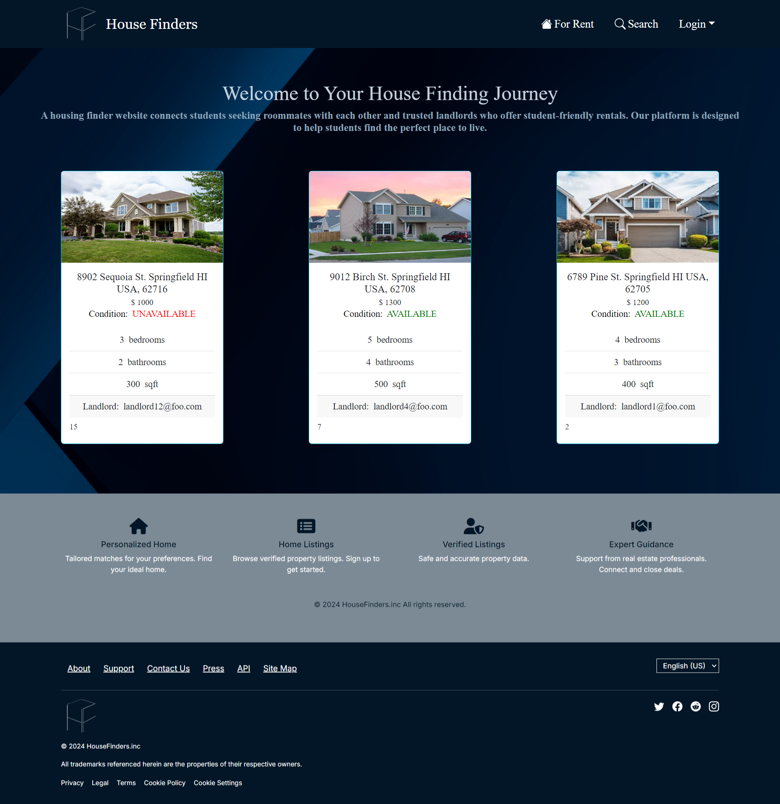
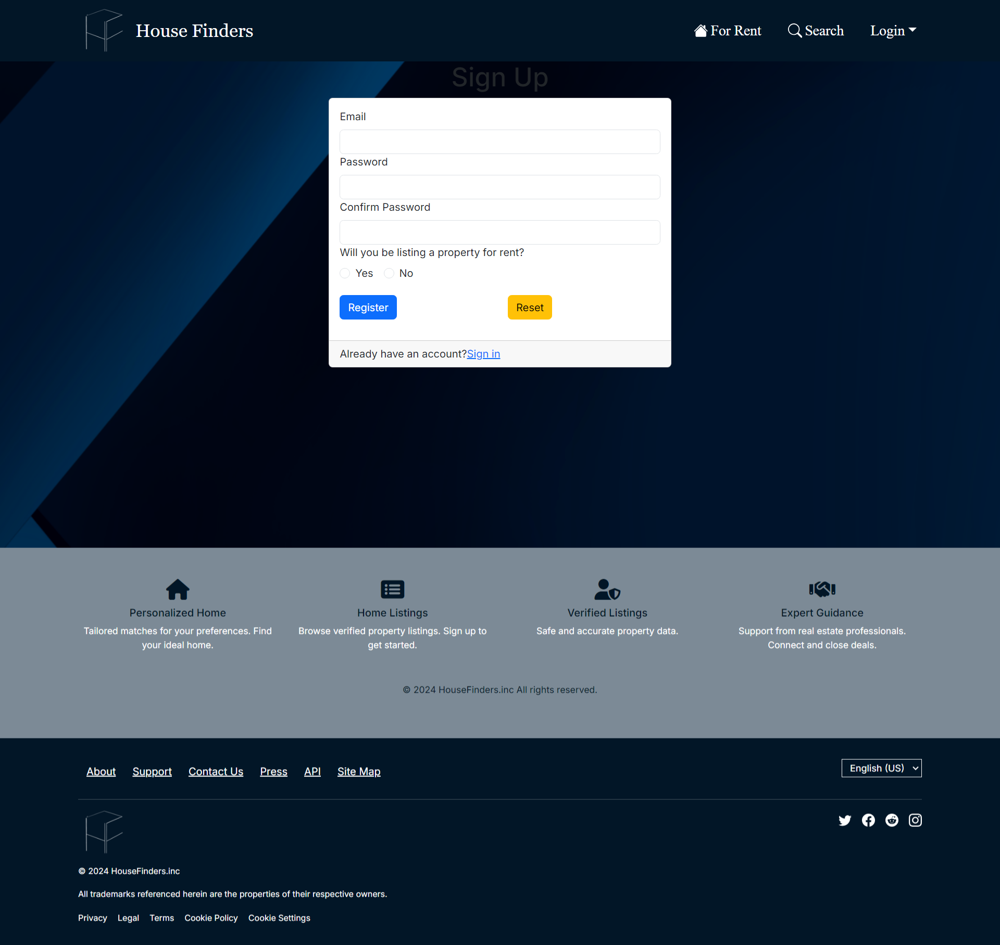
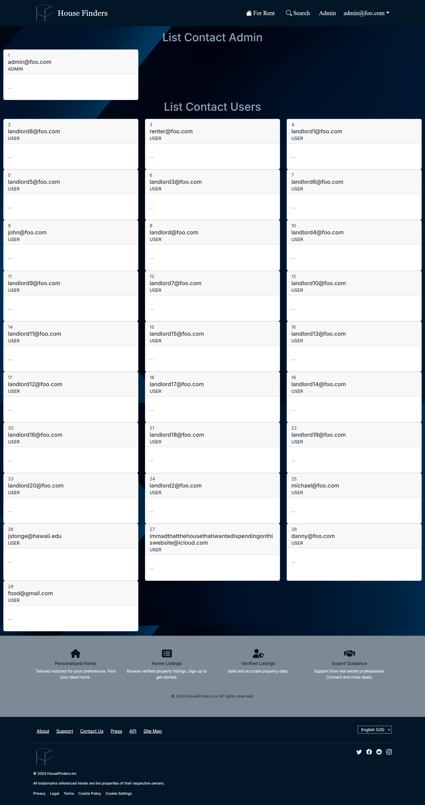

## Housing Finders

**The Problem:** UH’s out-of-state students, who are in search of affordable housing outside of dormitories, are faced with several challenges. Students that do not have connections with local residents will struggle to find trustworthy landlords to contact. To lower living costs, most of these students will also need to actively seek suitable roommates while managing other challenges related to moving for college. Additionally, safety is a crucial concern for students that live on their own as they are miles of ocean away from family, especially with the recent rise of criminal activity around the Manoa campus (the most populated campus). While students can live in the dorms, this also introduces several challenges, such as limited availability for each dormitory, a lack of private kitchen and bathroom, and mandatory meal plans that drive up living expenses. Furthermore, many students have also expressed concerns about the condition of the dorms.

**The Solution:** A housing finder website that will help students connect with other students to find roommates, and to also help cultivate a community of trusted landlords that can offer housing for student tenants. This idea would benefit a community of people that need to rent out housing and benefit students that need a place to stay. Safety can be ensured by confirming each person’s identity if their profile is verified and up-to-date, and may also feature a rating system that displays comments from previous tenants. Potentially, different account roles can be included: landlords, guests, users, admin. There is also the potential of sharing geo-location as a feature to show how far users are from prospective renters using React.

### Names of the proposers

Ciara Kang, Deolian Domawa, Trevell Pruitt, Kyle Aipoalani, Michael Lee

### Team Contract 
View our team contract <a href="https://docs.google.com/document/d/1OPMXnWsIcY8U7ur1HiLvndvDN062rf0UwQRU0RcMYBI/edit?tab=t.0#heading=h.wfvnqsw5pp">here</a>.

### Deployment
See our web application at: <a href="https://house-finders.vercel.app/">https://house-finders.vercel.app/</a>

### Project Plans

<a href="https://github.com/orgs/house-finders/projects/3">Milestone 1</a>

<a href="https://github.com/orgs/house-finders/projects/6">Milestone 2</a>

### Want to contribute?
Click on this <a href="https://github.com/house-finders/house-finders">link</a> to access our github repository to contribute.

### Mockup page ideas

The Housing Finder website will include but are not limited to:
* Landing page
* Admin home page
* Landlord home page
* User home page
* Guest home page (default if not logged in)
* User Profile page
* Landlord Profile page
* Categories page
* Category page
* Create Listing page (listing a property for rent)
* Property page
* Notify admin page

### Use case ideas

Whether or not the following bullet points list all pages or not, the completed use case should show an end-to-end scenario of using the system.

* Guest goes to landing page, creates an account.
* New user goes to landing page, logs in, gets home page, sets up profile. (How do they learn how system works?)
* New landlord goes to landing page, logs in, gets home page, sets up profile, add listings. (How do they learn how system works?)
* Admin goes to landing page, logs in, gets home page, edits site.
* User goes to landing page, logs in, browses categories, finds listing, contacts landlord.
* Landlord goes to landing page, logs in, contacts user that is interested, edits listing. (Put on hold)
* User and Landlord interact to confirm deal
* Landlord and admin interact to remove listing. (Prevent ghosting and fraud)
* Landlord and admin interact to ban inappropriate usage
* User and admin interact to ban inappropriate usage

### Beyond the basics

After implementing the basic functionality, here are ideas for more advanced features:

* A rating/review system for renters and past tenants
* Map-based interface to show where properties are from every UH campus
* Sorting feature for housings based on price, location from A to B, rating, etc.
* Mobile-friendly interface

## Application walkthrough

The application differs depending on the role that you have on the website. You can be not logged-in or logged-in as an admin, customer, or landlord. Depending on the role that your account has, the application shows different information and options displayed.

### Landing page
When you first visit the page, it displays a page that looks like: 
    

### Create a user
To use this web application, an account is needed. Press the sign up button on the top right to create an account.
    
When signing up, you will need an email and a password for the account. Additionally, the purpose for creating an account is also needed. This will determine the type of account that you will have, and allow you to access different parts of the application based on your role.
 

### Landlords
This section will go over what certain parts of the web application that relate to landlords. Feel free to skip this part if this does not pertain to you.

#### Creating a new listing
When creating a new listing, click on the "Add Properties" button on the top. You will need to fill out a form that asks for information about the property that you are trying to list.
    
This includes:
 - The address of the property
 - The price you want to set the property at
 - The number of bedrooms
 - The number of bathrooms
 - The size of the property in square feet
 - The overall condition of the property

#### Seeing your listings
To see all the listing you made, click on the "See Properties" button on the top. This will redirect you to a page listing out all the listings that you made so far.
    

### Admin
As an admin, you will be able to see all the accounts created on this web application. Please note that you will not be able to access this page if you are not an admin. The accounts will be listed like this:
    
This page contains information such as the email a user used to create an account and the role that they have.
