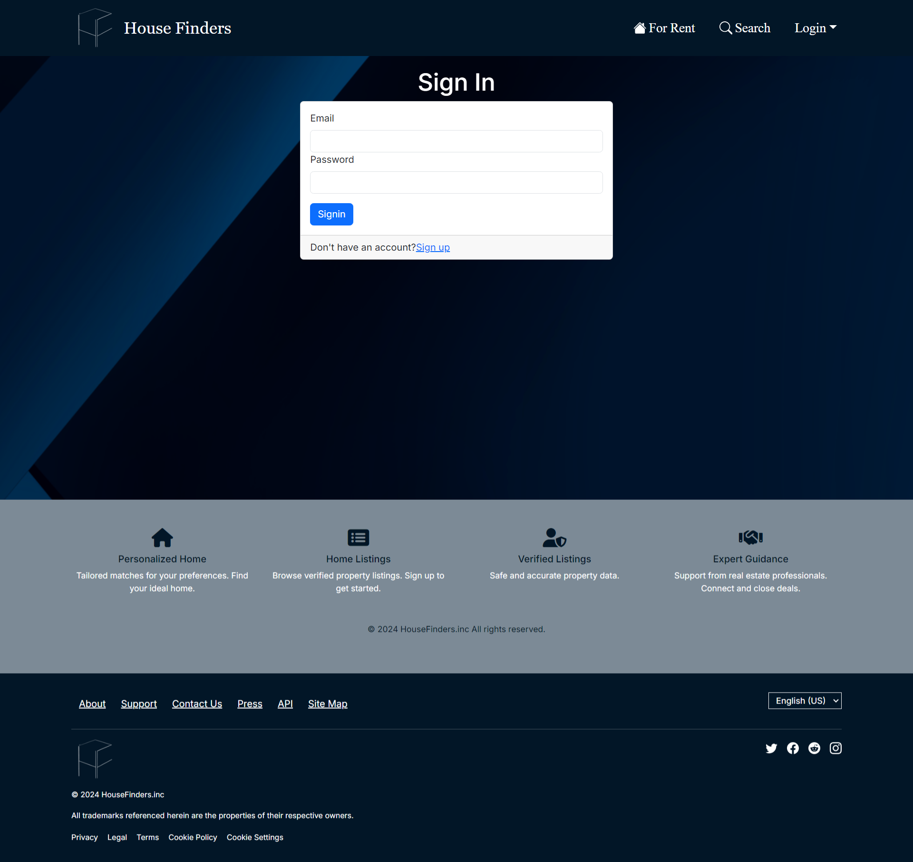
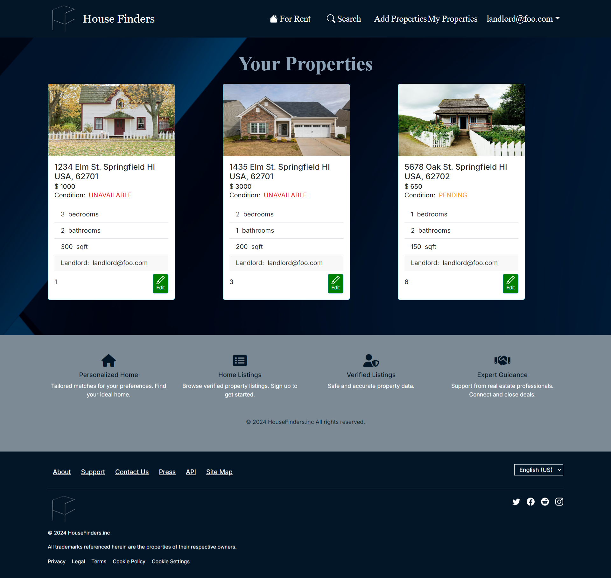

## Housing Finders

**The Problem:** UH’s out-of-state students, who are in search of affordable housing outside of dormitories, are faced with several challenges. Students that do not have connections with local residents will struggle to find trustworthy landlords to contact. To lower living costs, most of these students will also need to actively seek suitable roommates while managing other challenges related to moving for college. Additionally, safety is a crucial concern for students that live on their own as they are miles of ocean away from family, especially with the recent rise of criminal activity around the Manoa campus (the most populated campus). While students can live in the dorms, this also introduces several challenges, such as limited availability for each dormitory, a lack of private kitchen and bathroom, and mandatory meal plans that drive up living expenses. Furthermore, many students have also expressed concerns about the condition of the dorms.

**The Solution:** A housing finder website that will help students connect with other students to find roommates, and to also help cultivate a community of trusted landlords that can offer housing for student tenants. This idea would benefit a community of people that need to rent out housing and benefit students that need a place to stay. Safety can be ensured by confirming each person’s identity if their profile is verified and up-to-date, and may also feature a rating system that displays comments from previous tenants. Potentially, different account roles can be included: landlords, guests, users, admin. There is also the potential of sharing geo-location as a feature to show how far users are from prospective renters using React.

### Names of the proposers

Ciara Kang, Deolian Domawa, Trevell Pruitt, Kyle Aipoalani, Michael Lee

### Team Contract 
View our team contract <a href="https://docs.google.com/document/d/1OPMXnWsIcY8U7ur1HiLvndvDN062rf0UwQRU0RcMYBI/edit?tab=t.0#heading=h.wfvnqsw5pp">here</a>.

### Deployment
See our web application at: <a href="https://house-finders.vercel.app/">https://house-finders.vercel.app/</a>

### Project Plans

<a href="https://github.com/orgs/house-finders/projects/3">Milestone 1</a>

<a href="https://github.com/orgs/house-finders/projects/6">Milestone 2</a>

<a href="https://github.com/orgs/house-finders/projects/11">Milestone 3</a>

### Want to contribute?
Click on this <a href="https://github.com/house-finders/house-finders">link</a> to access our github repository to contribute.

## Community Feedback

#### Response 1: A. N
"The website is incredibly user-friendly, making it easy to navigate. Logging in and signing out is quick and effortless. I also appreciate its clean and simple design."

#### Response 2: J. SO
"House Finders makes finding places to rent very simple and with how the website is designed. The website itself is visibly appealing, it keeps just enough information to not be over whelming while also keeping your attention to keep scrolling through the options."

#### Response 3: D. B
"I like how this website can help students find housing that fits their price range while also giving you the option to see how many bedrooms and bathrooms etc it has. I also like how it shows the availability of the property."

#### Response 4: C. G
"This site offers a wide range of useful features, such as advanced search and filters that make finding products or services incredibly easy. It also feels responsive on mobile devices."

#### Response 5: R. K
"It worked seamlessly and felt effortless to use. The experience was smooth, with no interruptions or delays, making navigation pleasant and efficient."

## Developer Guide

### Overview 
This guide offers instructional support for developers looking to download their own version of our application for their own personal use. Please follow the steps below to ensure that your clone is created correctly.

To download the repository, visit the official GitHub project listed in the contribution section above.

### Prerequisites
Please make sure that you have: 
<ul>
  <li> Node.js </li>
  <li> npm (node package manager) </li>
  <li> git </li>
  <li> VSCode </li>
</ul>

### Setup
#### 1. Clone the repository
Please open your terminal in VSCode and type the following into it:

```
git clone https://github.com/house-finders/house-finders.git
```

#### 2. Install npm into your workspace
Then run this line after the line above has finished running:

```
npm install
```

#### 3. Running the application
To see the application as you are working on it, run: 

```
npm run dev
```

This will allow you to see what you are changing in real time

<br>
## User Guide
The application differs depending on the role that you have on the website. You can be not logged-in or logged-in as an admin, customer, or landlord. Depending on the role that your account has, the application shows different information and options displayed.

### Landing page
When you first visit the page, three random properties will be shown. It will display a page that looks like: 
<br>  <br>

### Logging in
To further use this web application, an account is needed. Press the sign up button on the top right to create an account.
<br>  <br>
When signing up, you will need an email and a password for the account. Additionally, the purpose for creating an account is also needed. This will determine the type of account that you will have, and allow you to access different parts of the application based on your role.

If you already have an account with us, then you can skip the step above.
<br>
Instead click on the sign in button on the top right to log in.
<br>  <br>
Please add your credentials to the appropriate boxes to login to your account.
<br>

#### Seeing all the listings
To see all the listings currently available, click on the "For Rent" button on the top. This will redirect you to a page listing out of all the listings made by all landlord users.
<br>  <br>

### Landlords
This section will go over what certain parts of the web application that relate to landlords. Feel free to skip this part if this does not pertain to you.

#### Creating a new listing
When creating a new listing, click on the "Add Properties" button on the top. You will need to fill out a form that asks for information about the property that you are trying to list.
<br>  <br>
This includes:
 - The address of the property
 - The price you want to set the property at
 - The number of bedrooms
 - The number of bathrooms
 - The size of the property in square feet
 - The overall condition of the property

#### Seeing your listings
To see all the listing you made, click on the "My Properties" button on the top. This will redirect you to a page listing out all the listings that you made so far.
<br>  <br>

### Admin
As an admin, you will be able to see all the accounts created on this web application. Please note that you will not be able to access this page if you are not an admin. The accounts will be listed like this:
<br>  <br>
This page contains information such as the email a user used to create an account and the role that they have.
<br>
### Search
In this section, you will be able to further explore properties efficiently depending on the search curriculum. There are various elements to narrow down your search. 
This includes searches for:
 - Availability of the property
 - Price
 - Number of bedrooms
 - Number of bathrooms
 - The size of the property in square feet

After pressing the "Search" button after setting your parameters, properties will show up that match what you're looking for. 
<br>  <br>